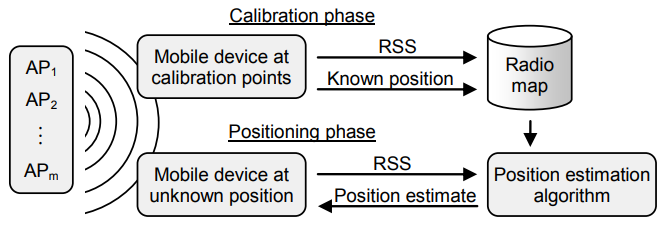

# indoor localization

Indoor Positioning Systems aims to detect the position of user or device by using Access Points’ signal also called “Wi-Fi fingerprint”.

Indoor Positioning Systems aims to detect the position of user or device by using Access Points’ signal also called “Wi-Fi fingerprint”. Each WiFi fingerprint can be characterized by the detected Wireless Access Points (WAPs) and the corresponding Received Signal Strength Intensity (RSSI). Then the coordinates (latitude, longitude, building number & floor) and Building ID are provided as the attributes to be predicted.

There are two notebooks showing the setup of "position esitmation algorithm" illustrated in diagram below.

One notebook shows the setup of one model performing regression tasks to predict: longtitude and latitude.

Another notebook shows the setup of two models performing classifcation tasks: (1) building ID and (2) floor level
